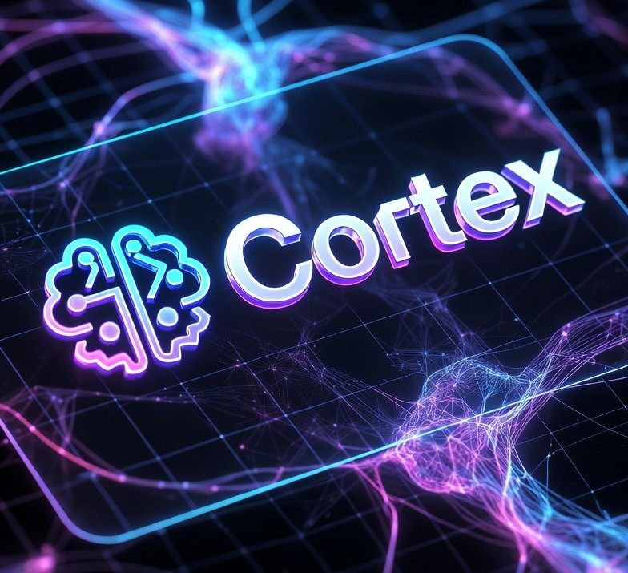

# Cortex

<p align="center">
  
</p>

Cortex est un framework d'agents IA spécialisés, prêts à être intégrés dans n'importe quel projet.

## 🚀 Concept

Chaque agent est composé de **4 couches indépendantes** :

```
┌─────────────────────────────────┐
│   project-context.md            │  ← Vos règles métier, conventions locales
├─────────────────────────────────┤
│   stacks/{techno}.md            │  ← Best practices techno (PHP, Docker…)
├─────────────────────────────────┤
│   personalities/{theme}/        │  ← Personnalité optionnelle (ex: H2G2)
├─────────────────────────────────┤
│   roles/{role}.md               │  ← Compétences métier génériques
└─────────────────────────────────┘
```

> *"Expliquons ça comme si la Terre venait d'être détruite et qu'on devait repartir de zéro."* — Arthur Dent

| Couche | Répond à | Exemple |
|---|---|---|
| `roles/` | **QUOI** faire | "Un lead backend structure, review, mentore" |
| `stacks/` | **COMMENT** le faire | "En PHP : PSR-12, injection de dépendances..." |
| `personalities/` | **QUI** tu es | "Hactar, méthodique, élégant" |
| `project-context.md` | **OÙ** tu travailles | "Ce projet : Symfony 7.2, PHP 8.3, MySQL 8" |

Cette séparation permet de :
- Changer de **personnalité** (H2G2, Star Wars, corporate…) sans toucher aux compétences
- Réutiliser les **rôles** sur n'importe quelle stack technique
- Partager les **best practices** d'une techno entre tous les projets qui l'utilisent
- Personnaliser le **contexte projet** sans modifier les agents

## 📁 Structure

```
cortex/
├── README.md                          # Ce fichier
├── setup.sh                           # Script d'installation
├── templates/
│   └── copilot-instructions.md        # Template auto-généré à l'install
│
├── agents/
│   ├── project-context.md             # Contexte projet (à remplir)
│   │
│   ├── roles/                         # Couche 1 : Compétences (agnostique)
│   │   ├── prompt-manager.md
│   │   ├── architect.md
│   │   ├── lead-backend.md
│   │   ├── lead-frontend.md
│   │   ├── security-engineer.md
│   │   ├── qa-automation.md
│   │   ├── platform-engineer.md
│   │   ├── product-owner.md
│   │   ├── tech-writer.md
│   │   ├── data-analyst.md
│   │   ├── compliance-officer.md
│   │   ├── dba.md
│   │   ├── business-analyst.md
│   │   ├── performance-engineer.md
│   │   └── consultant-platform.md
│   │
│   ├── stacks/                        # Couche 2 : Best practices techniques
│   │   ├── languages/
│   │   │   ├── php.md
│   │   │   └── typescript.md
│   │   ├── frameworks/
│   │   │   └── symfony.md
│   │   ├── infrastructure/
│   │   │   ├── docker.md
│   │   │   └── kubernetes.md
│   │   ├── databases/
│   │   │   └── mysql.md
│   │   └── security/
│   │       └── owasp.md
│   │
│   └── personalities/                 # Couche 3 : Thèmes de personnalité
│       └── h2g2/                      # Thème H2G2 (Guide du voyageur galactique)
│           ├── theme.md
│           ├── characters.md
│           └── {personnage}.md        # Fiche personnalité individuelle
│
└── docs/
    └── creating-a-theme.md            # Guide pour créer un thème
```

## 🔧 Installation

### Option 1 : Script automatique (recommandé)

```bash
# Ajout en submodule Git
git submodule add <url-cortex> cortex

# Installation avec thème H2G2 (défaut)
./cortex/setup.sh

# Sans personnalité
./cortex/setup.sh --no-personality

# Avec un thème spécifique
./cortex/setup.sh --theme star-wars
```

### Option 2 : Manuel

1. Copiez `cortex/templates/copilot-instructions.md` dans `.github/copilot-instructions.md`
2. Remplissez `cortex/agents/project-context.md`
3. Invoquez un agent via `@NomAgent` dans votre IDE (Copilot, Cursor, etc.)

## 🎯 Philosophie

- **Zéro dépendance projet** : les rôles sont agnostiques, la stack est dans `project-context.md`
- **Plug & Play** : `setup.sh` et c'est prêt
- **Composable** : rôle + stack + personnalité + contexte = agent complet
- **Best practices partagées** : les fiches `stacks/` sont réutilisables d'un projet à l'autre
- **Évolutif** : ajoutez vos propres rôles, stacks ou thèmes de personnalité

> *"La documentation, c'est le thé du développeur : personne n'en veut jusqu'à ce qu'il en ait désespérément besoin."* — Arthur Dent
