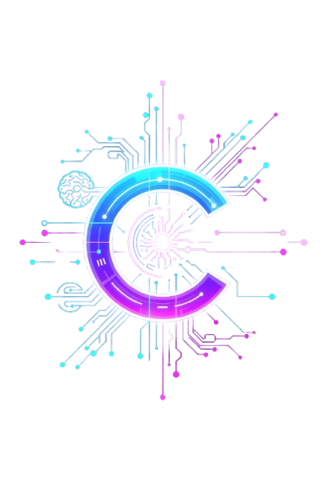

# Cortex

<p align="center">
  
</p>

Cortex est un framework d'agents IA spécialisés, prêts à être intégrés dans n'importe quel projet.

## 🚀 Concept

Chaque agent est composé de **5 couches indépendantes** :

```
┌─────────────────────────────────┐
│   project-overview.md           │  ← Vision, acteurs, contraintes métier
│   project-context.md            │  ← Stack, conventions, outils
├─────────────────────────────────┤
│   capabilities/{techno}.md      │  ← Compétences techniques chargeables (PHP, Docker…)
├─────────────────────────────────┤
│   personalities/{theme}/        │  ← Personnalité optionnelle (ex: H2G2)
├─────────────────────────────────┤
│   roles/{role}.md               │  ← Compétences métier génériques
├─────────────────────────────────┤
│   workflows/{contexte}.md       │  ← Trames d'orchestration multi-agents
└─────────────────────────────────┘
```

> *"Expliquons ça comme si la Terre venait d'être détruite et qu'on devait repartir de zéro."* — Arthur Dent

| Couche | Répond à | Exemple |
|---|---|---|
| `roles/` | **QUOI** faire | "Un lead backend structure, review, mentore" |
| `capabilities/` | **CE QUE JE SAIS FAIRE** | "En PHP : PSR-12, injection de dépendances..." |
| `personalities/` | **QUI** tu es | "Hactar, méthodique, élégant" |
| `project-overview.md` | **POURQUOI** tu travailles | "Mission : plateforme B2B, acteurs, contraintes business" |
| `project-context.md` | **OÙ / COMMENT** tu travailles | "Ce projet : Symfony 7.2, PHP 8.3, MySQL 8" |
| `workflows/` | **DANS QUEL ORDRE et AVEC QUI** | "Feature dev : architect → backend → QA → sécu → doc" |

Cette séparation permet de :
- Changer de **personnalité** (H2G2, Star Wars, corporate…) sans toucher aux compétences
- Réutiliser les **rôles** sur n'importe quelle stack technique
- Partager les **best practices** d'une techno entre tous les projets qui l'utilisent
- Personnaliser le **contexte projet** sans modifier les agents
- Définir des **workflows** réutilisables (génériques dans cortex) ou spécifiques (dans le projet hôte via `agents/workflows/`)

## 📁 Structure

```
cortex/
├── README.md                          # Ce fichier
├── setup.sh                           # Script d'installation
├── templates/
│   ├── copilot-instructions.md              # Bootstrap mode projet unique
│   ├── copilot-instructions-workspace.md    # Bootstrap mode workspace multi-projets
│   ├── project-overview.md.template         # Template vue d'ensemble (vision & métier)
│   ├── project-context.md.template          # Template contexte technique
│   └── workflow.md.template                 # Template pour créer un workflow projet
│
├── agents/
│   ├── roles/                         # Couche 1 : Rôles métier (agnostiques)
│   │   ├── prompt-manager.md         # Point d'entrée (racine, toujours actif)
│   │   ├── engineering/               # Conception & réalisation technique
│   │   │   ├── architect.md
│   │   │   ├── lead-backend.md
│   │   │   ├── lead-frontend.md
│   │   │   ├── dba.md
│   │   │   ├── platform-engineer.md
│   │   │   ├── performance-engineer.md
│   │   │   ├── consultant-platform.md
│   │   │   └── qa-automation.md
│   │   ├── product/                   # Vision produit & métier
│   │   │   ├── product-owner.md
│   │   │   └── business-analyst.md
│   │   ├── security-compliance/       # Sécurité & conformité
│   │   │   ├── security-engineer.md
│   │   │   └── compliance-officer.md
│   │   ├── data/                      # Données & analytique
│   │   │   └── data-analyst.md
│   │   └── communication/             # Contenu & transmission
│   │       └── tech-writer.md
│   │
│   ├── capabilities/                   # Couche 2 : Compétences techniques chargeables
│   │   ├── languages/
│   │   │   ├── php.md
│   │   │   └── typescript.md
│   │   ├── frameworks/
│   │   │   └── symfony.md
│   │   ├── infrastructure/
│   │   │   ├── docker.md
│   │   │   └── kubernetes.md
│   │   ├── databases/
│   │   │   └── mysql.md
│   │   └── security/
│   │       └── owasp.md
│   │
│   ├── personalities/                 # Couche 3 : Thèmes de personnalité
│   │   └── h2g2/                      # Thème H2G2 (Guide du voyageur galactique)
│   │       ├── theme.md
│   │       ├── characters.md
│   │       └── {personnage}.md        # Fiche personnalité individuelle
│   │
│   └── workflows/                     # Couche 5 : Trames d'orchestration multi-agents
│       ├── README.md
│       ├── feature-development.md
│       └── tech-watch.md
│
└── docs/
    ├── getting-started.md             # Guide d'installation pas à pas
    └── creating-a-theme.md            # Guide pour créer un thème
```

## 🔧 Installation

### Prérequis

- Git
- Un IDE avec support Copilot (VS Code, Cursor, etc.)

### Étape 1 — Ajouter Cortex au projet

```bash
# En submodule Git (recommandé — partagé entre projets)
git submodule add <url-cortex> cortex

# Installation — projet unique (thème H2G2 par défaut)
./cortex/setup.sh

# Sans personnalité
./cortex/setup.sh --no-personality

# Avec un thème spécifique
./cortex/setup.sh --theme star-wars
```

### Mode workspace — multi-projets

Pour un workspace contenant plusieurs services/repos (microservices, monorepo, multi-repo VSCode) :

```bash
# Placez cortex dans le dossier parent (pas forcément un repo git)
# workspace/
# ├── cortex/
# ├── service-a/
# └── service-b/

./cortex/setup.sh --workspace
# Le script demande interactivement les noms de services à initialiser
# Il crée project-overview.md et project-context.md dans chaque service
# avec le bon @alias pré-rempli
```

Chaque service déclare son `@alias` dans son `project-overview.md`. Pour cibler un service dans un prompt :
```
@backend Ajoute un endpoint de pagination sur /users
@frontend Crée un composant de tableau avec tri
```
Si aucun alias n'est mentionné, Cortex déduit le service depuis les fichiers ouverts dans l'IDE.

### Option 2 : Manuel

1. Copiez `cortex/templates/copilot-instructions.md` dans `.github/copilot-instructions.md`
2. Copiez `cortex/templates/project-overview.md.template` → `project-overview.md` et remplissez la vision
3. Copiez `cortex/templates/project-context.md.template` → `project-context.md` et remplissez la stack
4. Invoquez un agent via `@NomAgent` dans votre IDE (Copilot, Cursor, etc.)

## 📚 Documentation

- [**Getting Started**](docs/getting-started.md) — guide d’installation pas à pas (projet unique & workspace)
- [**Créer un thème**](docs/creating-a-theme.md) — personnaliser le ton et le style des agents

## 🎯 Philosophie

- **Zéro dépendance projet** : les rôles sont agnostiques, la stack est dans `project-context.md`
- **Plug & Play** : `setup.sh` et c'est prêt — mode projet unique ou workspace multi-projets
- **Composable** : rôle + capacités + personnalité + contexte + workflow = agent complet
- **Deux fichiers de contexte** : `project-overview.md` (vision & métier) + `project-context.md` (stack & conventions) — séparés pour ne jamais mélanger le QUOI et le COMMENT
- **Capacités chargeables** : les fiches `capabilities/` sont réutilisables d'un projet à l'autre, et chargées automatiquement par le PM selon le rôle actif et la stack du projet
- **Multi-projets** : mode workspace avec `@alias` par service — Cortex détecte le service actif depuis le prompt ou les fichiers ouverts
- **Évolutif** : ajoutez vos propres rôles, capacités, thèmes, workflows ou services

> *"La documentation, c'est le thé du développeur : personne n'en veut jusqu'à ce qu'il en ait désespérément besoin."* — Arthur Dent
